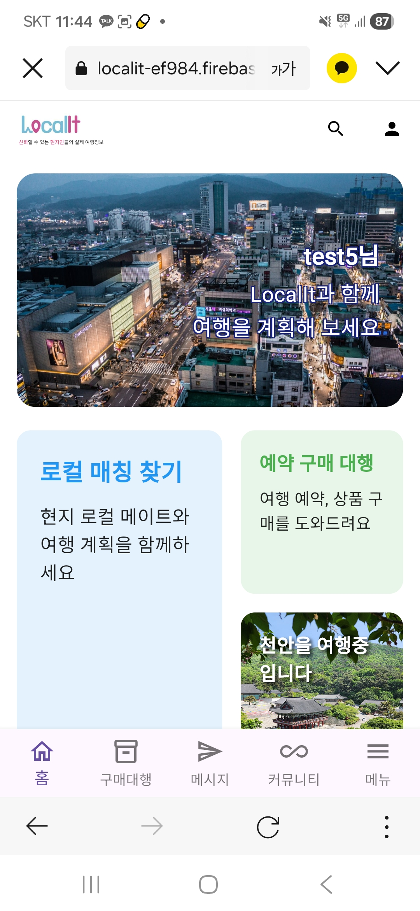
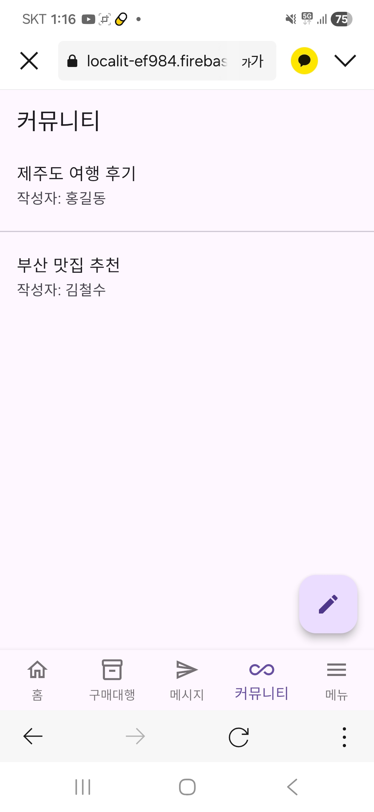

# LocalIt - 관광객 현지인 매칭 서비스

LocalIt은 여행객과 현지인을 연결해 현지 경험, 동행, 구매 대행, 커뮤니티 활동을 지원하는 매칭 서비스입니다. Flutter Web 기반의 클라이언트와 Firebase 서버리스 백엔드를 분리해 구성했으며, 인증, 사용자 프로필, 매칭, 채팅, 미디어 저장, 배포까지 서비스 운영에 필요한 전체 흐름을 직접 설계하고 구현한 프로젝트입니다.

## 프로젝트 개요

| 구분 | 내용 |
| --- | --- |
| 서비스명 | LocalIt |
| 주제 | 관광객-현지인 매칭 및 현지 경험 연결 플랫폼 |
| Frontend | Flutter Web, Dart, Firebase SDK |
| Backend | Node.js, Firebase Cloud Functions |
| Infrastructure / DB | Firebase Hosting, Cloud Firestore, Firebase Storage |
| 주요 기능 | 회원가입, 로그인, 프로필 관리, 현지인/여행객 매칭, 채팅, 커뮤니티, 구매 대행 |

## 핵심 성과

- Flutter Web 빌드 결과물을 Firebase Hosting에 연결해 웹 서비스 배포 흐름을 구성했습니다.
- `firebase.json`을 직접 설정해 Hosting, Cloud Functions, Firestore, Storage, Emulator 구성을 통합 관리했습니다.
- Node.js 기반 Firebase Cloud Functions를 API 계층으로 분리해 회원가입, 이메일 중복 확인, 사용자 정보 수정 등 비즈니스 로직을 서버리스 환경에서 처리했습니다.
- Cloud Firestore 문서 구조를 `shared_models`의 JSON Schema로 정리해 프론트엔드 모델과 백엔드 데이터 구조 간의 기준을 명확히 했습니다.
- Firebase Storage Rules를 구성해 프로필 이미지와 사용자 업로드 파일의 접근 범위를 분리했습니다.

## 배포 화면 미리보기

실제 Firebase Hosting 배포 웹을 실행한 뒤 캡처 및 녹화한 화면입니다.

### 주요 화면

| 홈 화면 | 커뮤니티 게시판 |
| --- | --- |
|  |  |

| 예약 대행 화면 | 구매 대행 화면 |
| --- | --- |
|  |  |

### 등록 플로우

| 로컬인 등록 | 여행 게시글 등록 |
| --- | --- |
|  |  |

### 매칭 및 채팅 플로우

| 로컬인 매칭 | 여행자 매칭 |
| --- | --- |
|  |  |

## 주요 기능

### 사용자 인증 및 프로필

- Firebase Authentication 기반 로그인/회원가입 화면 구성
- 여행객과 현지인 사용자 타입 분리
- 닉네임, 연락처, 언어, 관심사, 인증 정보 등 사용자 프로필 저장
- 현지인 등록 및 인증 상태 관리 구조 설계

### 관광객-현지인 매칭

- 여행객 소개글 및 여행 정보 입력 화면 구성
- 현지인 탐색, 상세 정보 확인, 매칭 요청 화면 구성
- 매칭 상태를 `pending`, `accepted` 등으로 관리할 수 있는 백엔드 도메인 구조 설계
- 매칭 수락 이후 채팅방 생성으로 이어지는 서비스 흐름 구현 기반 마련

### 채팅

- 채팅방 및 메시지 모델 구성
- 채팅 목록/상세 화면 구현
- Firestore 기반 실시간 메시지 동기화를 고려한 데이터 구조 설계

### 커뮤니티 및 커머스

- 커뮤니티 홈, 게시글 작성, 게시글 상세 화면 구성
- 구매 대행 화면과 결제/리뷰/구매 요청 모델 구성
- 여행 중 필요한 현지 도움 요청까지 확장 가능한 서비스 구조 설계

## 기술 스택

### Frontend

- Flutter Web
- Dart
- Firebase Core
- Firebase Auth
- Cloud Firestore
- Firebase Storage
- Image Picker
- HTTP Client

### Backend

- Node.js 22
- Firebase Cloud Functions v2
- Firebase Admin SDK
- Firebase Functions SDK
- ESLint

### Infrastructure

- Firebase Hosting
- Cloud Firestore
- Firebase Storage
- Firebase Emulator Suite
- Firestore Security Rules
- Storage Security Rules

## 아키텍처

```text
Flutter Web Client
        |
        | Firebase SDK / HTTPS API
        v
Firebase Hosting  ----->  Firebase Cloud Functions
        |                         |
        |                         v
        |                 Business Logic Layer
        |                         |
        v                         v
Cloud Firestore <---------- Firebase Admin SDK
        |
        v
Firebase Storage
```

프론트엔드는 Flutter 단일 코드베이스로 구성되어 웹을 중심으로 동작하며, Firebase Hosting을 통해 배포됩니다. 백엔드는 Cloud Functions에서 독립적인 API로 관리되고, 데이터는 Cloud Firestore와 Firebase Storage에 저장됩니다.

## 프로젝트 구조

```text
localit_develop/
├── app/                         # Flutter 클라이언트
│   ├── lib/
│   │   ├── main.dart            # 앱 진입점 및 라우팅
│   │   ├── firebase_options.dart
│   │   ├── models/              # 클라이언트 데이터 모델
│   │   │   ├── auth/
│   │   │   ├── chat/
│   │   │   ├── commerce/
│   │   │   ├── matching/
│   │   │   └── notification/
│   │   └── screens/             # 기능별 화면
│   │       ├── auth/
│   │       ├── chat/
│   │       ├── commerce/
│   │       ├── common/
│   │       ├── community/
│   │       ├── matching/
│   │       └── setting/
│   ├── assets/                  # 로고 및 서비스 이미지
│   ├── web/                     # Flutter Web 정적 리소스
│   └── pubspec.yaml
├── functions/                   # Firebase Cloud Functions
│   ├── index.js                 # HTTPS Function 엔드포인트 등록
│   ├── controller/              # 요청/응답 처리 계층
│   ├── domain/                  # 비즈니스 로직
│   ├── entity/                  # Firestore 엔티티 구조
│   ├── config/                  # Firebase Admin 초기화
│   ├── test.http                # API 테스트 요청 예시
│   └── package.json
├── shared_models/               # Firestore 문서 JSON Schema
├── firebase.json                # Hosting, Functions, Rules, Emulator 설정
├── firestore.rules              # Firestore 보안 규칙
├── firestore.indexes.json       # Firestore 인덱스 설정
├── storage.rules                # Storage 보안 규칙
└── cors.json                    # Storage CORS 설정
```

## Cloud Functions API

현재 `functions/index.js`에서 등록된 HTTPS Function은 다음과 같습니다.

| API | 역할 |
| --- | --- |
| `registerUser` | 사용자 회원가입 후 Firestore `users`, `locals` 컬렉션에 프로필 저장 |
| `checkEmailDuplicate` | Firestore `users` 컬렉션 기준 이메일 중복 확인 |
| `updateUserProfile` | 사용자 프로필 정보 수정 |

`functions/controller`와 `functions/domain`에는 매칭, 채팅, 여행객 소개글 기능 확장을 위한 컨트롤러와 도메인 로직이 분리되어 있습니다.


## 실행 방법

### Flutter Web

```bash
cd app
flutter pub get
flutter run -d chrome
```

### Firebase Functions Emulator

```bash
cd functions
npm install
npm run serve
```

### Firebase 배포

```bash
# Flutter Web 빌드
cd app
flutter build web

# 프로젝트 루트에서 Firebase Hosting / Functions 배포
cd ..
firebase deploy
```

Functions만 배포할 경우:

```bash
cd functions
npm run deploy
```

## Firebase 설정 요약

`firebase.json`에서 다음 리소스를 함께 관리합니다.

- `functions`: `functions/` 디렉터리를 Cloud Functions 소스로 사용
- `hosting`: `app/build/web`을 Firebase Hosting 정적 배포 경로로 사용
- `rewrites`: Flutter Web SPA 라우팅을 위해 모든 경로를 `/index.html`로 전달
- `firestore`: `firestore.rules`, `firestore.indexes.json` 적용
- `storage`: `storage.rules` 적용
- `emulators`: Functions, Firestore, Storage 로컬 테스트 포트 관리

## 담당 역할

- Flutter Web 기반 프론트엔드 화면 및 라우팅 구현
- Firebase Authentication, Firestore, Storage 연동
- Node.js 기반 Cloud Functions API 설계 및 구현
- Firestore 컬렉션 구조와 공유 스키마 설계
- Firebase Hosting 배포 설정 및 SPA 리라우팅 구성
- Firebase 보안 규칙, Emulator, 배포 설정 관리

## 프로젝트 의의

LocalIt은 단순한 화면 구현을 넘어, 프론트엔드 빌드 결과물이 배포되고 Cloud Functions API와 Firestore 데이터베이스, Storage 업로드 자원까지 연결되는 전체 서비스 생명주기를 직접 다룬 프로젝트입니다. 서버리스 아키텍처 안에서 기능별 책임을 분리하고, Firebase 기반 인프라를 활용해 빠르게 확장 가능한 관광객-현지인 매칭 서비스를 구현하는 데 중점을 두었습니다.
